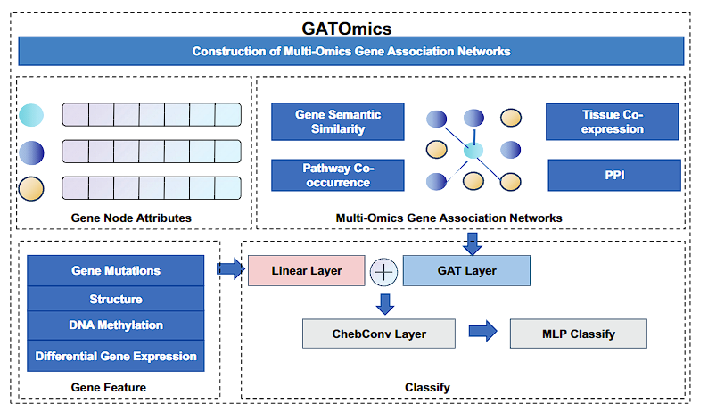

# GATOmics: A Multi-Omics Graph Attention Network for Cancer Driver Gene Detection

## Overview

GATOmics is a novel multi-omics framework designed for identifying cancer driver genes by integrating multiple biological networks. These networks include Protein-Protein Interactions (PPI), Tissue Co-Expression, Pathway Co-Occurrence, and Gene Semantic Similarity networks. By leveraging the power of Graph Attention Networks (GATs), GATOmics enhances feature extraction and representation, improving the accuracy of cancer gene prediction.

## Features

- Integrates multi-omics data from diverse biological networks.
- Utilizes self-attention mechanisms to capture long-range gene interactions.
- Employs a semi-supervised learning framework to generalize across different cancer types.
- Demonstrates high performance on pan-cancer datasets, surpassing state-of-the-art methods such as EMOGI and MTGCN.

## Datasets 

- Protein-Protein Interaction (PPI) Networks from ConsensusPathDB
- Tissue Co-Expression Data from The Cancer Genome Atlas (TCGA)
- Pathway Co-Occurrence Data from KEGG and Reactome
- Gene Semantic Similarity based on Gene Ontology terms

## Model Structure

- GAT Layers: Utilizes attention mechanisms to aggregate node features.
- Feature Fusion Module: Combines multi-omics data to enhance feature representation.

## Results
GATOmics has been evaluated on several pan-cancer datasets, demonstrating superior performance in terms of AUC and AUPRC compared to baseline models:

AUC: 0.9163
AUPRC: 0.8401

## License
This project is licensed under the MIT License.